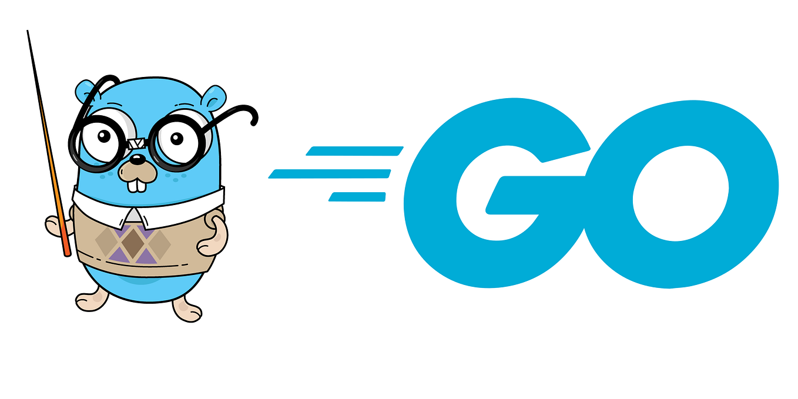

<p align="center">
  
</p>
<div align="center">
  
# Learning-Golang

Repository che documenta il mio percorso di apprendimento del linguaggio **Go (Golang)**.

## Chi sono
Sono Martina Marcolini, studentessa di Informatica all'Università degli Studi di Milano. Questo repo nasce per tenere traccia dei miei progressi, ragionare sulle soluzioni e costruire nel tempo un riferimento personale su ciò che imparo.

## Struttura del repository

```
Learning-Golang/
├── University_Golang/     ← esercizi assegnati durante il corso universitario
└── Exercism_Golang/       ← esercizi della piattaforma Exercism (prossimamente)
```

## Come sono organizzati gli esercizi

Ogni esercizio ha la propria cartella numerata con il seguente contenuto:

```
XX_Nome_Esercizio/
├── nomefile.go    ← il mio codice con commenti
└── README.md      ← testo dell'esercizio, output di esempio, concetti usati e note personali
```

Nelle note personali documento sempre il mio ragionamento: se ho trovato più approcci, spiego le differenze e perché uno è migliore dell'altro.

## Argomenti affrontati finora

| # | Esercizio | Argomenti chiave |
|---|-----------|-----------------|
| 01 | Rettangolo | `var`, `:=`, `fmt.Scan`, operazioni aritmetiche |
| 02 | Cerchio | `float64`, `math.Pi`, `fmt.Print` vs `fmt.Println` |
| 03 | Convertitore Km→Miglia | `const`, costanti a livello di package |
| 04 | Calcolo Età | conversione di tipo `float64()`, `math.Floor`, `math.Ceil` |
| 05 | Area Poligono | `math.Pow`, `math.Tan`, precedenza degli operatori |
| 06 | Divisione con Resto | operatore modulo `%` |
| 07 | Secondi→Ore/Minuti | `fmt.Printf`, scomposizione del tempo con `/` e `%` |
| 08 | Numero Invertito | estrazione di cifre, nomi semantici delle variabili |
| 09 | Intero con Segno | `if / else`, verbo `%+d` |
| 10 | Multiplo di 10 | pattern di divisibilità con `%` |
| 11 | Valutazione Voto | `if / else if / else`, condizioni ridondanti, bug silenziosi |
| 12 | Fizz Buzz | minimo comune multiplo, `else` esplicito vuoto |
| 13 | Pari o Dispari | pattern `% 2 == 0` |
| 14 | Divisione con Controllo Zero | divisione per zero, verbo `%g` |
| 15 | Angoli del Triangolo | validazione input, "valida prima, calcola dopo" |
| 16 | Convertitore di Tempo | menu interattivo, `if` annidati, conversioni a cascata |
| 17 | Punto e Retta | confronto `float64`, equazione della retta |
| 18 | Tabelline | primo ciclo `for` |
| 19 | Somma Pari in Intervallo | swap idiomatico `a, b = b, a`, `i += 2`, principio DRY |
| 20 | Operazioni su N Valori | scope delle variabili, `return` anticipato, min/max con primo valore |

## Stack


